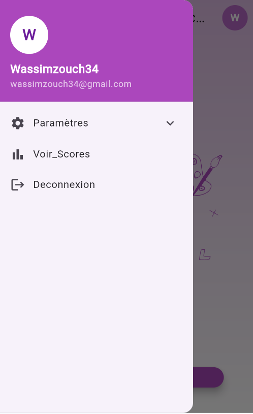
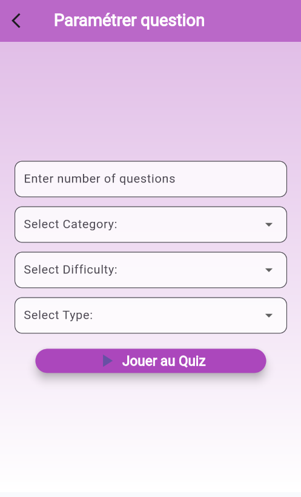
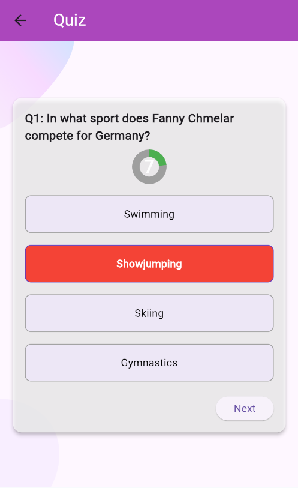

# Mon Projet Flutter - Quiz App

Une application Flutter pour un quiz interactif, avec un design élégant et une navigation fluide.

## Captures d'écran

### Page de connexion

### Menu Drawer

### Formulaire

### Historique

### Page d'accueil

### Inscription

### Quiz (en cours)

### Quiz complété

### Page d'accueil (Welcome)

